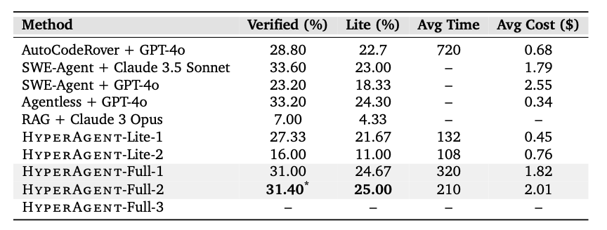

    

     
    
     

  
    

<a href="paper/main.pdf">Technical Report</a>

    
# HyperAgent: Generalist Software Agents to Solve Coding Tasks at Scale

<!-- 

 -->
 
   
    
## Overview

HyperAgent is a generalist multi-agent system designed to tackle a wide spectrum of software engineering (SE) tasks across various programming languages. Unlike existing LLM-based software agents that typically specialize in specific tasks, HyperAgent mimics human developers' workflows to address diverse SE challenges. Comprising four specialized agents (Planner, Navigator, Code Editor, and Executor), it manages the full lifecycle of SE tasks from conception to verification. 

HyperAgent demonstrates state-of-the-art performance in:

- GitHub issue resolution ([SWE-Bench-Python](https://www.swebench.com/))
- Repository-level code generation ([RepoExec-Python](https://github.com/FSoft-AI4Code/RepoExec))
- Fault localization and program repair ([Defects4J-Java](https://github.com/rjust/defects4j))

Notably, HyperAgent is designed to handle a codebase written in a wide range of programming languages. We currently support Python and Java and plan to expand to other languages on other tasks/benchmarks in the future.

### Key Features
- Generalizability: Easily adapts to various tasks with minimal configuration changes.
- Efficiency: Optimized agents manage processes of varying complexity using appropriate LLM capabilities.
- Scalability: Built to handle large-scale, real-world software engineering scenarios effectively.
- Multi-task Proficiency: Excels in GitHub issue resolution, code generation, fault localization, and program repair. existing development workflow with its Python API, allowing for flexible and powerful code interactions.

## Evaluation Results
### SWE-Bench

     
    
     

    
## Architecture

     
    
     

