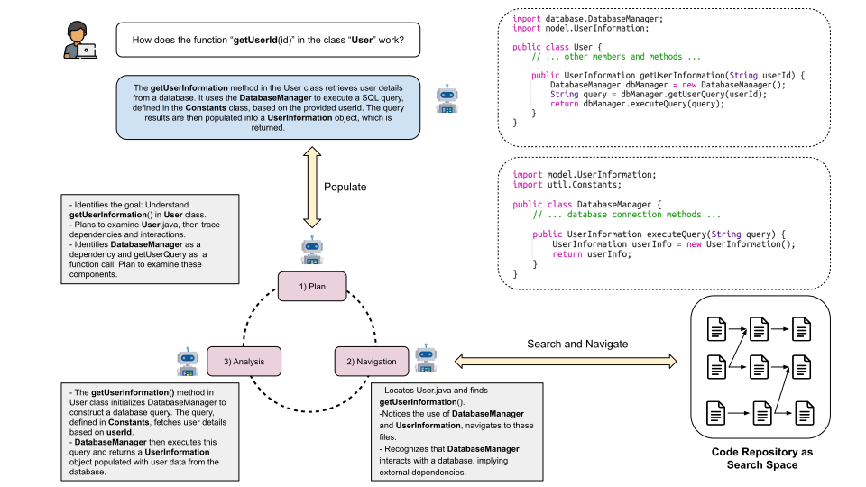

    
<p align="center">
    <br>
    
    <br>
<p>
<div align="center">
  <a href="https://opensource.org/license/apache-2-0/">
  
  </a>
   <a href="https://www.python.org/downloads/release/python-3100/">
  
  </a> 


    
# RepoPilot: A Multi-Agent Library to Explore Your Codebase

<!-- 
[](https://github.com/bdqnghi/CodeTF_personal/blob/main/LICENSE)
[](https://www.python.org/downloads/release/python-390/)
[](https://github.com/psf/black) -->
 </div>   
    
## Table of Contents
  - [Introduction](#overview)
  - [Installation](#installation)
  - [Getting Started](#use-cases) 
  - [Architecture](#architecture)

## Overview

RepoPilot is a multi-agent system based on Large Language Models (LLMs) designed to assist developers in navigating and understanding codebases. It serves as a next-generation coding assistant, offering insights and actions based on the analysis of the entire code repository.

**RepoPilot Demo:**

[](https://youtu.be/5Wm4oVZ6pjs)

## Installation
RepoPilot uses Zoekt for code search. Please install Zoekt before installing RepoPilot. Zoekt requires latest Go installation, please follow the instructions [here](https://www.linuxedo.com/2021/10/install-latest-golang-on-linux.html) to install Go.

```bash
go get github.com/sourcegraph/zoekt/

# Install Zoekt Index
go install github.com/sourcegraph/zoekt/cmd/zoekt-index
# Install Zoekt Web Server
go install github.com/sourcegraph/zoekt/cmd/zoekt-webserver
```
We also need to install universal-ctags for semantic code search. Please follow the instructions [here](https://github.com/sourcegraph/sourcegraph/blob/main/doc/dev/how-to/zoekt_local_dev.md#install-ctags). Remember to set the environment variable of CTAGS `CTAGS_COMMAND=universal-ctags`. Finally, we can install RepoPilot.

```bash
pip3 install -e .
```

## Key Features
- **Multi-lingual Support**: Supports multiple programming languages, including Java, Python, Rust and C#.
- **Codebase Exploration**: Enables developers to query about specific features or components within a codebase (e.g., asking about the login feature in a repository).
- **Impact Analysis**: Assesses the potential impact of changes in the codebase, providing a holistic view of how modifications may affect the overall project.
- **Actionable Insight**s: Provides recommendations and executes predefined actions based on the analysis of queries and codebase status.

## Use Cases

- **Feature Inquiry and Analysis**: Developers can inquire about specific features (e.g., authentication systems, API integrations) within the codebase, and RepoPilot provides detailed insights and suggestions for improvement or modification.
- **Code Impact Assessment**: Before implementing changes, developers can assess how these changes might impact the entire repository, including dependencies, performance, and potential bugs.
- **Automated Code Navigation**: Assists in navigating complex codebases, making it easier for developers to understand and work with large and complex projects.

### Example Usages

```python
# Importing the RepoPilot library
import repopilot

# Initialize RepoPilot with the path to your code repository
repo_path = "/path/to/your/codebase"
rp = repopilot.RepoPilot(repo_path)

# Example 1: Natural Language Query about a Feature
# User asks about the login feature in a conversational manner
query = "Please explain how the login features work in this codebase."
login_feature_explanation = rp.query_codebase(query)
print("Login Feature Explanation:")
print(login_feature_explanation)

# Example 2: Impact of Changes in Natural Language
# User asks about the impact of a specific change
change_query = "What would be the impact if I refactor the authentication module?"
change_impact = rp.query_codebase(change_query)
print("Impact of Refactoring Authentication Module:")
print(change_impact)

# Example 3: Code Improvement Suggestions in Conversational Style
# User asks for general improvement suggestions
improvement_query = "How can I improve the code quality of the project?"
improvement_suggestions = rp.query_codebase(improvement_query)
print("Code Improvement Suggestions:")
print(improvement_suggestions)

# Example 4: Searching for Code Patterns using Natural Language
# User wants to find certain types of functions or methods
search_query = "Find all asynchronous functions in the codebase."
async_functions = rp.query_codebase(search_query)
print("Asynchronous Functions Found:")
print(async_functions)

# Example 5: Bug reproduction from Bug reports
# User wants to generate a fail-to-pass test case from a bug report
search_query = "Write a JUnit test case code in java that reproduce the failure behavior of the given bug report as following: {bug_report (in this case is Time 23 Defects4J)}."
bug_reproduction = rp.query_codebase(search_query)
print("Bug Reproduction:")
```

## CLI Usage

```bash
usage: repopilot [--help] [command: setup, query]
```

### Setup 
Usage: repopilot setup [OPTIONS] REPO_PATH [ARGS]...          
```bash                                                        
╭─ Arguments ──────────────────────────────────────────────────────────────────────────────────────────────────────╮
│ *    repo_path      TEXT  The path to the repository to set up. [default: None] [required]                       │                                                                                           
╰──────────────────────────────────────────────────────────────────────────────────────────────────────────────────╯
╭─ Options ────────────────────────────────────────────────────────────────────────────────────────────────────────╮
│ *  --repository-name        TEXT  The name of the repository. [default: None] [required]                         │                                                                                           
│ *  --language               TEXT  The programming language of the repository. [default: None] [required]         │                                                                                           
│    --commit                 TEXT  The commit to set up.                                                          │                                                                                           
│    --local-agent            TEXT  local agent path [default: model/mistral-7B]                                   │                                                                                           
│    --devices                TEXT  devices to use for inference [default: 0]                                      │
│    --clone-dir              TEXT  The directory to clone the repository to. [default: data/repos]                │
│    --gh-token               TEXT  The GitHub token to use for cloning private repositories. [default: ""]        │
│    --help                         Show this message and exit.                                                    │
╰──────────────────────────────────────────────────────────────────────────────────────────────────────────────────╯
                                                                                                                                               
``` 

### Query
Usage: repopilot query [OPTIONS] REPO_PATH [ARGS]...          
```bash                                            
╭─ Arguments ─────────────────────────────────────────────────────────────────────────────────────────────────────╮
│ *    repository_name      TEXT  The name of the repository to query. [default: None] [required]                 │                                                                                       
╰─────────────────────────────────────────────────────────────────────────────────────────────────────────────────╯
╭─ Options ───────────────────────────────────────────────────────────────────────────────────────────────────────╮
│ --planner-type                  TEXT  The type of planner to use. [default: adaptive]                           │                                                                                            
│ --save-trajectories-path        TEXT  The path to save the trajectories to. [default: None]                     │                                                                                            
│ --help                                Show this message and exit.                                               │                                                                                            
╰─────────────────────────────────────────────────────────────────────────────────────────────────────────────────╯
```
## Architecture
<p align="center">
    <br>
    
    <br>
<p>

RepoPilot is a multi-agent system that consists of three main components: the **Planning Agent**, the **Navigation Agent**, and the **Analysis Agent**. 
- **Planning Agent** is responsible for understanding the user's query and determining a draft plan of action. The planning agent is based on GPT-4 prompted with a query and general information about the codebase.

- **Navigation Agent** is responsible for navigating the codebase, finding relevant code snippets and storing high value information related to the query into the working memory. The navigation agent is implemented with ReAct-like architecture with dynamic backtracking as well as multi-languages language server protocol (mLSP) support to efficiently navigate inside the codebase (go-to-definition, find references, code search, semantic code search, etc).

- **Analysis Agent** is responsible for finally giving the user the insights and recommendations based on the query and the information stored in the working memory. The analysis agent is based on GPT-4 prompted with the query and the information stored in the working memory.

## Acknowledgements
We would like to thank the development of [Multiplspy](https://github.com/microsoft/monitors4codegen), [Supporting Multiple languages chunking](https://github.com/langchain-ai/langchain/pull/13318) and [codetext parser](https://github.com/FSoft-AI4Code/CodeText-parser) for the multi-language support of the navigation agent.
